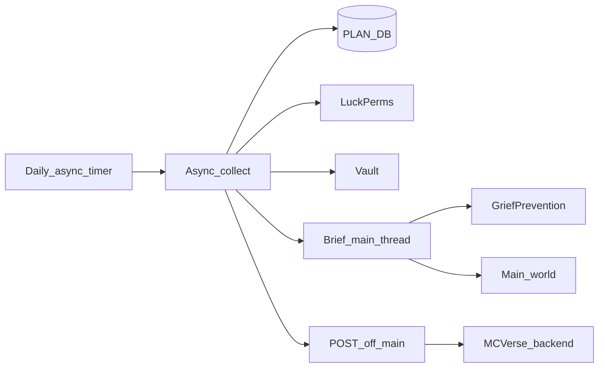
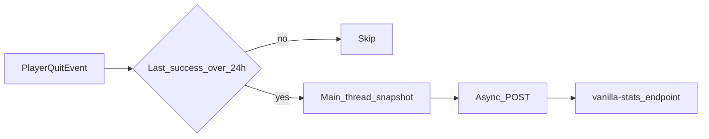

# Server-wide PLAN stats sync

The existing sync in `[PlayerStateSyncService](MCVerseRegister/src/main/java/net/mcverse/register/service/PlayerStateSyncService.java)` is **per-player** and runs on join (`POST /api/v1/sync/players/{uuid}/...`). The numbers you listed are **server-wide**, so this will be a new scheduled snapshot, not another player-join category.

This repo is the Paper plugin only. The plugin will POST the payload; the MCVerse backend must add an ingest route before the website can display it.




## Vanilla stats vs the daily server snapshot

Vanilla Minecraft statistics are **not** used for the daily server-wide dashboard (no weekly window; summing every player is expensive; PLAN already has timed kills/deaths/playtime).

They **are** synced separately as **per-player all-time** data for **every player who quits**, whether or not they have a website account. The backend keeps **no vanilla history** — only current values plus `last_synced_at`. “This week” for public/server dashboards stays on the **server stats daily rows** (PLAN fields).

**Server-wide stats do keep daily snapshots:** each successful daily POST is a new (or upserted) row keyed by calendar date so the site can show latest and chart over time.

## Per-player vanilla stats (quit, ~once per day, all players)

**Works for unlinked players (all sync, not only vanilla).** Identity is the Minecraft UUID / `players` row. Website email is an optional link on that row.

- Plugin POSTs on join (username, balance, groups, simpleclans, claims) **and** on quit (vanilla stats) for every player. Backend **get-or-creates** a stub `players` row if needed.
- Do **not** skip diagnostic sync because GET `/auth/player/{uuid}` is 404 or `registered: false`. That flag only means “no website account,” not “no Minecraft player.”
- [`PlayerStateSyncService`](MCVerseRegister/src/main/java/net/mcverse/register/service/PlayerStateSyncService.java) unlinked-cache-on-404 must **not** suppress all categories for unlinked players. 404 means the **route** is missing (or a true unknown UUID after get-or-create failed), not “unregistered website user.”
- Login hint for unlinked players still points at `/register`. If they are **already website-linked** and run `/register`, do **not** POST `/auth/register` (no magic-link resend). Send: “Your account is already linked.” plus a clickable **Click to login** that opens `https://www.mcverse.city/login` (`ClickEvent.openUrl` via Paper Adventure). Keep a note that `/unregister` unlinks. URL from config `login-url` (default that HTTPS URL). [`MessageUtil`](MCVerseRegister/src/main/java/net/mcverse/register/util/MessageUtil.java) today is legacy color strings; this message needs an Adventure `Component`.
- **`/unregister` and `/mcvadmin remove` only unlink** website account/email from the UUID. They must **not** `DELETE` the `players` row and must **not** wipe balance, groups, clans, claims, or vanilla stats. Data stays on the UUID. After unlink, `/register` can attach an email to the stub again.

CASCADE on `players` delete can remain for a future hard-delete/GDPR path. Unregister is an **UPDATE** (clear email / website user id), not a delete.

Trigger: [`PlayerQuitEvent`](MCVerseRegister/src/main/java/net/mcverse/register/listeners/PlayerListener.java). Check 24h throttle **before** clearing `RegistrationCache`. Do not skip because `isRegistered` is false.

Throttle: rolling **24 hours** per UUID since last **successful** vanilla-stats POST (config `sync.vanilla-stats.min-interval-hours: 24`). Multiple quits the same day are skipped. Persist last success to `plugins/MCVerseRegister/vanilla-stats-last-sync.yml` so a restart does not send again immediately.



Threading: `Player.getStatistic` must run **during the quit handler on the main thread** (the `Player` is not reliable after the event returns). Build a POJO/map in memory, then `runTaskAsynchronously` for JSON + HTTP. Iterate Paper **registries** (`Registry.STATISTIC` / `Material` / `EntityType`) rather than a hardcoded key list so new 26.2 blocks, entities, and custom stats appear automatically.

### Vanilla stats JSON (wire format)

`POST /api/v1/sync/players/{uuid}/vanilla-stats`

Content-Type `application/json`. UUID is in the URL, not duplicated in the body.

This matches Mojang’s `world/stats/<uuid>.json` `stats` object (Java Edition namespaced keys, stable since 1.13). The plugin adds envelope fields. **Do not send `DataVersion` as the only version signal** — include `minecraftVersion` from the server.

**Rules:**

- All map values are non-negative integers (`long` / JSON number). No floats.
- **Omit zeros** and omit empty category objects.
- Keys are always full namespaced IDs (`minecraft:stone`, never `stone`).
- Unknown future keys (26.2+) are allowed; backend must treat `category` and `stat_key` as open `text`, not enums.
- Plugin compiles against Paper **1.21.11** (`paper-api 1.21.11-R0.1-SNAPSHOT` today) and must keep working on **26.2** without a payload-schema break. Bump the Paper dependency when the server moves; do not freeze a list of custom stat keys in code.

**Envelope:**

| Field | Type | Required | Meaning |
|---|---|---|---|
| `observedAt` | string ISO-8601 UTC | yes | When the snapshot was taken (also last seen) |
| `minecraftVersion` | string | yes | `Bukkit.getMinecraftVersion()` e.g. `"1.21.11"` or `"26.2"` |
| `minecraftUsername` | string | yes | Current in-game name |
| `firstPlayed` | string ISO-8601 UTC | yes | `OfflinePlayer.getFirstPlayed()` — first join on this server |
| `lastSeen` | string ISO-8601 UTC | yes | Same as quit / `observedAt` |
| `balance` | number or null | yes | Vault balance if economy is present, else null |
| `primaryGroup` | string or null | yes | LuckPerms primary group if present, else null |
| `stats` | object | yes | Category → { namespaced key → count }. May be `{}` |

**`stats` categories** (these nine; extra categories if Mojang adds them later should be forwarded):

| Category key | Bukkit `Statistic.Type` | Inner keys | Value meaning |
|---|---|---|---|
| `minecraft:custom` | `UNTYPED` | custom stat ids | counts, distances in **cm**, times in **ticks**, damage in **tenths of a heart** (see below) |
| `minecraft:mined` | `BLOCK` (`MINE_BLOCK`) | block id | blocks mined |
| `minecraft:broken` | `ITEM` (`BREAK_ITEM`) | item id | items broken (durability ran out) |
| `minecraft:crafted` | `ITEM` (`CRAFT_ITEM`) | item id | items crafted/smelted/taken from output |
| `minecraft:used` | `ITEM` (`USE_ITEM`) | item id | items/blocks used |
| `minecraft:picked_up` | `ITEM` (`PICKUP`) | item id | items picked up |
| `minecraft:dropped` | `ITEM` (`DROP`) | item id | items dropped from inventory |
| `minecraft:killed` | `ENTITY` (`KILL_ENTITY`) | entity id | entities this player killed |
| `minecraft:killed_by` | `ENTITY` (`ENTITY_KILLED_BY`) | entity id | times this player was killed by that entity |

**Example (abbreviated; real bodies are much larger):**

```json
{
  "observedAt": "2026-08-21T22:15:00Z",
  "minecraftVersion": "1.21.11",
  "minecraftUsername": "Steve",
  "firstPlayed": "2024-03-01T18:00:00Z",
  "lastSeen": "2026-08-21T22:15:00Z",
  "balance": 1520.75,
  "primaryGroup": "citizen",
  "stats": {
    "minecraft:custom": {
      "minecraft:deaths": 10,
      "minecraft:player_kills": 2,
      "minecraft:mob_kills": 500,
      "minecraft:play_time": 12345678,
      "minecraft:play_one_minute": 12345678,
      "minecraft:jump": 4000,
      "minecraft:walk_one_cm": 8800000,
      "minecraft:sprint_one_cm": 1200000,
      "minecraft:damage_dealt": 15000,
      "minecraft:damage_taken": 8000,
      "minecraft:time_since_death": 24000,
      "minecraft:leave_game": 80
    },
    "minecraft:mined": {
      "minecraft:stone": 1200,
      "minecraft:deepslate": 400,
      "minecraft:diamond_ore": 14,
      "minecraft:oak_log": 90
    },
    "minecraft:killed": {
      "minecraft:zombie": 80,
      "minecraft:creeper": 12,
      "minecraft:ender_dragon": 1
    },
    "minecraft:killed_by": {
      "minecraft:skeleton": 3
    },
    "minecraft:crafted": {
      "minecraft:crafting_table": 1,
      "minecraft:diamond_pickaxe": 4
    },
    "minecraft:used": {
      "minecraft:diamond_pickaxe": 400,
      "minecraft:ender_pearl": 20
    },
    "minecraft:broken": {
      "minecraft:diamond_pickaxe": 3
    },
    "minecraft:picked_up": {
      "minecraft:cobblestone": 5000,
      "minecraft:rotten_flesh": 200
    },
    "minecraft:dropped": {
      "minecraft:dirt": 64
    }
  }
}
```

`minecraft:play_time` and `minecraft:play_one_minute` may both appear depending on Paper/Minecraft mapping; both are **ticks** (1/20 s). Backend should store whatever keys arrive. Distance `*_one_cm` keys are centimeters. Damage keys are tenths of 1 HP.

Common `minecraft:custom` keys the site will likely show (not an exhaustive allow-list): `deaths`, `player_kills`, `mob_kills`, `play_time`, `jump`, `walk_one_cm`, `sprint_one_cm`, `damage_dealt`, `damage_taken`, `fish_caught`, `animals_bred`, `sleep_in_bed`. 26.2 may add keys (e.g. new ride distances); they flatten into the same `player_vanilla_stat` table.

Endpoint: **200 for linked and unlinked.** Get-or-create stub `players` if needed. Later `/register` updates that stub. Plugin must **not** treat vanilla-stats 404 as “unlinked, never retry.” `/mcvadmin` will not need a per-player dump for v1.

Config:

```yaml
sync:
  vanilla-stats:
    enabled: true
    min-interval-hours: 24
```

## Backend ingest guide (MariaDB + Drizzle)

Backend lives outside this plugin repo (`backend/src/db/index.js`, `backend/src/db/schema.js`). **Do not use Postgres types.** Stack is MariaDB + Drizzle.

Type map:

- `timestamptz` → `TIMESTAMP`
- `uuid` → `VARCHAR(36)` (same as `players.minecraft_uuid`)
- `numeric` (server economy total) → `DECIMAL(20,2)` (wider than per-player `DECIMAL(14,2)`)
- `double precision` → `DOUBLE`
- `ON CONFLICT ... DO UPDATE` → `INSERT ... ON DUPLICATE KEY UPDATE` with `col = COALESCE(VALUES(col), col)` so JSON `null` does not blank a column
- Index `value` **without** `DESC` (MariaDB). `CHECK (value >= 0)` optional; enforce in Zod.

Migration: `backend/sql/036_server_and_vanilla_stats_sync.sql` (next after `035_ban_appeal_attachments.sql`). Ignore `2026-04-30-submitted-minecraft-username.sql` as “latest”. Mirror tables in `schema.js` and export them.

`stat_date`: calendar date of `observedAt` in **America/Chicago**. No shared Chicago helper for sync today (tournament-only in `backend/src/utils/tournamentTime.js`); add a small America/Chicago date helper for `stat_date`.

Auth / 422 / 5xx match existing player sync. User-Agent `MCVerseRegister/1.0.0`.

Vanilla identity: **FK to `players.id`**, plus stored `minecraft_uuid`. Get-or-create stub on ingest. **`DELETE /api/v1/auth/player/{uuid}` (unregister) only clears the website/email link.** Keep `players` and all sync tables. Do not delete on unregister. `/register` on an existing UUID attaches email to that row.

Website “linked?” uses the existing players/auth flag (email present, etc.). Plugin POSTs join diagnostics and quit vanilla stats for every player.

### 1. Server-wide snapshot (daily history)

`POST /api/v1/sync/server/stats`

```sql
CREATE TABLE server_stats_daily (
  stat_date DATE NOT NULL PRIMARY KEY,
  observed_at TIMESTAMP NOT NULL,
  week_start TIMESTAMP NULL,
  players_joined BIGINT NULL,
  rank_default INT NULL,
  rank_member INT NULL,
  rank_regular INT NULL,
  rank_citizen INT NULL,
  citizen_all INT NULL,
  economy_total DECIMAL(20,2) NULL,
  plan_regular_players INT NULL,
  total_playtime_ms BIGINT NULL,
  minecraft_day BIGINT NULL,
  average_tps DOUBLE NULL,
  player_kills_all_time BIGINT NULL,
  deaths_all_time BIGINT NULL,
  mob_kills_all_time BIGINT NULL,
  claimed_area BIGINT NULL,
  player_kills_this_week BIGINT NULL,
  deaths_this_week BIGINT NULL,
  mob_kills_this_week BIGINT NULL
);
```

Upsert:

```sql
INSERT INTO server_stats_daily (...) VALUES (...)
ON DUPLICATE KEY UPDATE
  observed_at = COALESCE(VALUES(observed_at), observed_at),
  week_start = COALESCE(VALUES(week_start), week_start),
  players_joined = COALESCE(VALUES(players_joined), players_joined)
  -- same COALESCE(VALUES(col), col) for every metric column
;
```

Website latest: `ORDER BY stat_date DESC LIMIT 1`. History: `WHERE stat_date >= ...`. Return `{ "success": true, "updated": true }`.

### 2. Per-player vanilla stats

`POST /api/v1/sync/players/{uuid}/vanilla-stats`

Lookup `players` by `minecraft_uuid`. If missing, **insert a stub player** (new `id`, `minecraft_uuid`, username from payload, not linked). If `/register` later hits a unique `minecraft_uuid`, update the stub instead of failing. Then upsert `player_vanilla_sync` + flatten `stats`. If `observedAt` is older than `last_synced_at`, 200 `updated: false`. Delete omitted keys. Do not increment. Body limit ~1 MB. Zod: `value >= 0`.

```sql
CREATE TABLE player_vanilla_sync (
  player_id VARCHAR(36) NOT NULL PRIMARY KEY,
  minecraft_uuid VARCHAR(36) NOT NULL,
  last_synced_at TIMESTAMP NOT NULL,
  minecraft_version VARCHAR(64) NULL,
  UNIQUE KEY uniq_player_vanilla_sync_uuid (minecraft_uuid),
  CONSTRAINT player_vanilla_sync_player_fk
    FOREIGN KEY (player_id) REFERENCES players (id) ON DELETE CASCADE
);

CREATE TABLE player_vanilla_stat (
  player_id VARCHAR(36) NOT NULL,
  minecraft_uuid VARCHAR(36) NOT NULL,
  category VARCHAR(128) NOT NULL,
  stat_key VARCHAR(128) NOT NULL,
  value BIGINT NOT NULL,
  PRIMARY KEY (player_id, category, stat_key),
  KEY player_vanilla_stat_category_idx (player_id, category, value),
  CONSTRAINT player_vanilla_stat_sync_fk
    FOREIGN KEY (player_id) REFERENCES player_vanilla_sync (player_id) ON DELETE CASCADE
);
```

Profile fields on the plugin payload (`minecraftUsername`, `firstPlayed`, `lastSeen`, `balance`, `primaryGroup`) update existing player/balance/groups tables where that is already the pattern — do not duplicate them as a new UUID-PK identity table.

Optional: denormalize `play_time` / `deaths` / `player_kills` / `mob_kills` onto `player_vanilla_sync` for cheap listing.

### 3. Admin UI (website)

**Overview → Server Stats** — table of `server_stats_daily`, newest first. Simple columns from that row. No charts in v1.

**Overview → Player Stats** — searchable table by player name (`players.minecraft_username`). Join `players`, `player_balances_sync`, groups sync, `player_vanilla_sync` / `player_vanilla_stat`. Includes stub (unlinked) players created by vanilla-stats ingest.

| Column | Source |
|---|---|
| Name | `players` username |
| First joined / register date | existing `players` created/first-played field |
| Last seen | `player_vanilla_sync.last_synced_at` or existing last-seen |
| Balance | `player_balances_sync` |
| Website linked? | existing players/auth flag (not a new table) |
| Rank | existing groups sync primary group |
| Play time / deaths / player kills / mob kills | `player_vanilla_stat` custom keys |

No mined-by-block UI in v1.

Join diagnostic sync must accept unlinked UUIDs the same way (get-or-create stub, 200, `registered: false` if no email). Do not 404.

## Data sources per field


| Field                                    | Source                                                      | Notes                                                                                                                         |
| ---------------------------------------- | ----------------------------------------------------------- | ----------------------------------------------------------------------------------------------------------------------------- |
| Total players joined                     | PLAN `plan_user_info` for this server                       | Offline included                                                                                                              |
| `#` default / member / regular / citizen | LuckPerms **primary group**                                 | Configurable group names; someone whose primary is citizen is not also counted as default                                     |
| Citizen (all)                            | LuckPerms group membership                                  | Second citizen stat: anyone who has/inherits `citizen`, even if primary is `supporter`, `mod`, etc.                           |
| Total economy $                          | Vault `getBalance(OfflinePlayer)` summed                    | Works offline if the economy plugin supports it (EssentialsX does)                                                            |
| PLAN “Regular” players                   | PLAN activity index `>= 2.0`                                | Matches PLAN’s overview number (Regular + Active + Very Active), **not** the LuckPerms `regular` rank                         |
| Total playtime                           | PLAN `plan_sessions` (`session_end - session_start`)        | Add current sessions for online players if `CommonQueries.fetchCurrentSessionPlaytime` is available (DB only updates on quit) |
| Minecraft day                            | `world.getFullTime() / 24000`                               | Config `main-world`; read on the main thread                                                                                  |
| Average TPS                              | PLAN `AVG(tps)` from `plan_tps` over last 24h               | Fallback: Paper `Bukkit.getTPS()[0]` (1-minute) if PLAN is missing                                                            |
| Player kills all-time / this week        | PLAN `plan_kills` count                                     | PvP kills with timestamps                                                                                                     |
| Deaths all-time / this week              | PLAN `SUM(plan_sessions.deaths)`                            | All death causes (PLAN’s Deaths), not PvP-only                                                                                |
| Mob kills all-time / this week           | PLAN `SUM(plan_sessions.mob_kills)`                         |                                                                                                                               |
| Total claimed area                       | GriefPrevention `DataStore.getClaims()` + `Claim.getArea()` | Top-level claims only (skip subdivisions so area is not double-counted). Units are claim blocks (X×Z)                         |


“This week” = **rolling last 7 days** (epoch ms), not calendar week.

PLAN Query API (`QueryService`) is the integration surface ([APIv5 Query API](https://github.com/plan-player-analytics/Plan/wiki/APIv5-Query-API)). `query()` / `CommonQueries` **block the calling thread** — all PLAN SQL runs async. Custom SQL must join `plan_servers` / `plan_users` because current schema (5.6+) uses `server_id` / `user_id` on sessions, not UUID columns. Detect columns at runtime (`doesDBHaveTableColumn`) so SQLite/MySQL both work.

PLAN Regular count will replicate PLAN’s 3-week activity-index formula (threshold `ActivityIndex.REGULAR = 2.0`). The playtime threshold is not exposed on Query API; config it to match Plan’s active-playtime setting (Plan default is 30 minutes = `1800000` ms).

LuckPerms has no cheap “count by primary group” query. The job will `getUniqueUsers()`, `loadUser` async, and tally in one pass:

- **Primary rank counts:** `user.getPrimaryGroup()` into `default` / `member` / `regular` / `citizen` (and ignore other primaries such as `mod` / `supporter` for those four buckets).
- **Citizen all:** increment when the user has the citizen group **including inheritance** — `user.getInheritedGroups(QueryOptions.defaultContextualOptions())` contains `citizen`, or they have an `InheritanceNode` for `citizen`. This picks up players whose primary is `supporter`, `mod`, or anything else but who still hold/inherit citizen.

`citizenAll` will be `>=` `rankCounts.citizen`. Counts are recomputed on each daily run (and on `/mcvadmin syncstats`).

If inherited-group lookup is awkward on some users, fall back to `UserManager.searchAll(NodeMatcher.key(InheritanceNode.builder("citizen").build()))` unioned with users whose assigned groups parent-inherit citizen. Prefer the single loadUser pass since it is already required for primary counts.

## Backend contract (plugin side)

New method on `[MCVerseApiClient](MCVerseRegister/src/main/java/net/mcverse/register/api/MCVerseApiClient.java)`:

`POST {api-base-url}/api/v1/sync/server/stats`

Same headers/retry style as player sync (3 attempts, exponential backoff, treat 5xx as retryable). 404 means the backend route is not deployed yet — log and skip, do not crash.

Example payload (null for a source that is offline):

```json
{
  "observedAt": "2026-08-21T20:00:00Z",
  "weekStart": "2026-08-14T20:00:00Z",
  "playersJoined": 1234,
  "rankCounts": { "default": 800, "member": 300, "regular": 90, "citizen": 44 },
  "citizenAll": 120,
  "economyTotal": 1234567.89,
  "planRegularPlayers": 120,
  "totalPlaytimeMs": 9876543210,
  "minecraftDay": 1842,
  "averageTps": 19.87,
  "playerKillsAllTime": 500,
  "deathsAllTime": 2000,
  "mobKillsAllTime": 80000,
  "claimedArea": 1500000,
  "playerKillsThisWeek": 12,
  "deathsThisWeek": 40,
  "mobKillsThisWeek": 3000
}
```

Backend/website ingest is **out of scope to implement in this repo**; the plugin POSTs the contract below. A written backend guide will live in-repo for the API team.

## Plugin implementation

New types (same DTO style as `[GroupsSyncRequest](MCVerseRegister/src/main/java/net/mcverse/register/api/GroupsSyncRequest.java)`):

- `ServerStatsSnapshot` + collectors (PLAN / LuckPerms / Vault / GP / world)
- `ServerStatsSyncRequest` JSON builder
- `ServerStatsSyncService` — daily schedule + assemble + POST (never on the main thread except a brief sync hop)
- `VanillaStatsSyncService` — quit snapshot + 24h throttle + POST `/vanilla-stats`
- Change join path: username + diagnostic fanout for every player; `registered` only drives the `/register` hint, `/unregister` availability, and the already-linked login component
- Change [`RegisterCommand`](MCVerseRegister/src/main/java/net/mcverse/register/commands/RegisterCommand.java) already-linked branch: Adventure clickable “Click to login” → `login-url` (default `https://www.mcverse.city/login`). No register POST.
- Unlinked-cache-on-404: do not use it to mean “website unregistered”
- Noop collectors when a softdep is missing so one missing plugin does not drop the whole snapshot

### Daily schedule (consistent, restart-safe)

Do **not** use a 5-minute timer. Run **once per calendar day** at a configured local time.

- Config `run-at: "10:00"` and `timezone: "America/Chicago"` (JVM zone if omitted).
- On enable, compute delay until the next `run-at`. Use `runTaskLaterAsynchronously`, then reschedule the following day after each attempt (do not use a 24h repeating timer from plugin-enable, which drifts after restarts).
- Persist last successful run to `plugins/MCVerseRegister/server-stats-last-run.yml` (`lastSuccessfulAt` ISO-8601).
- If the server was down at `run-at` and today’s run has not succeeded yet, fire **once shortly after enable** (small async delay, e.g. 60s so softdeps finish loading), then schedule tomorrow’s `run-at`.
- If today’s run already succeeded, skip until tomorrow’s `run-at` (restart at 10:30 must not send a second snapshot).
- Overlap guard: ignore a second trigger while a run is in progress.
- `/mcvadmin syncstats` still forces an extra run without changing the daily slot.

### Threading (stay off the main thread)

The daily job and the HTTP POST run on Bukkit’s **async** scheduler. PLAN SQL, LuckPerms `loadUser` / `getUniqueUsers`, Vault balance summation, snapshot JSON, and the backend POST must never run on the main thread.

A **short main-thread hop** is required only for APIs that are not thread-safe:

- `World.getFullTime()` (Minecraft day)
- GriefPrevention `DataStore.getClaims()` / `Claim.getArea()`

Use `Bukkit.getScheduler().callSyncMethod(...)` (or `runTask` + `CompletableFuture`) for that slice, then continue assembly and `POST` on the async thread. Paper TPS (`Bukkit.getTPS()`) can be read async. Do not block the main thread waiting on PLAN, LuckPerms, or network I/O.

Wire the scheduler from `[MCVerseRegister](MCVerseRegister/src/main/java/net/mcverse/register/MCVerseRegister.java)` `onEnable`.

Config additions in `[config.yml](MCVerseRegister/src/main/resources/config.yml)`:

```yaml
login-url: "https://www.mcverse.city/login"

sync:
  server-stats:
    enabled: true
    run-at: "10:00"
    timezone: "America/Chicago"
    catch-up-on-startup: true
    main-world: world
    plan-active-playtime-ms: 1800000
    ranks:
      default: default
      member: member
      regular: regular
      citizen: citizen
  vanilla-stats:
    enabled: true
    min-interval-hours: 24
```

Also:

- `[plugin.yml](MCVerseRegister/src/main/resources/plugin.yml)`: softdepend `Plan`
- `[pom.xml](MCVerseRegister/pom.xml)`: Plan API via JitPack, `provided`. Stay on Paper `1.21.11-R0.1-SNAPSHOT` for this work; vanilla collectors must iterate registries so a later bump to Paper **26.2** does not require a payload-schema change.
- `[/mcvadmin syncstats](MCVerseRegister/src/main/java/net/mcverse/register/commands/AdminCommand.java)`: force one snapshot for testing
- Tests: payload field assertions (extend `[SyncPayloadRequestTest](MCVerseRegister/src/test/java/net/mcverse/register/api/SyncPayloadRequestTest.java)`), including both `rankCounts.citizen` (primary) and `citizenAll`; next-run / already-ran-today scheduler tests; service test that POSTs when enabled and skips when disabled
- README: MariaDB/Drizzle contracts (`036_...sql`, `players.id` FK, Chicago `stat_date`, Overview admin tables)
- Tests: vanilla-stats payload omits zeros; throttle skips a second quit inside 24h

Join diagnostic sync (username, balance, groups, clans, claims) runs for unlinked players too: get-or-create stub, no 404-unlinked cache. `/unregister` only clears the website link.